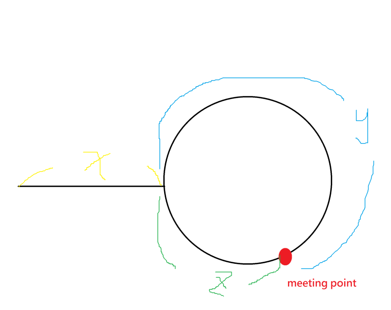

# Solution for problem 287_Find_the_Duplicate_Number

Because the number is from 1 to n and except the duplicate number, others are unique, so we can use partition, and each time reject half numbers.

At first the search space is numbers between 1 to n. Each time I select a number `mid` (which is the one in the middle) and count all the numbers equal to or less than `mid`. Then if the `count` is more than `mid`, the search space will be `[1 mid]` otherwise `[mid+1 n]`. I do this until search space is only one number.

For example, let's say `n=10` and I select `mid=5`. Then I count all the numbers in the array which are less than equal `mid`. If the there are more than `5` numbers that are less than `5`, then one of them has occurred more than once. So I shrink the search space from `[1 10]` to `[1 5]`. Otherwise the duplicate number is in the second half so for the next step the search space would be `[6 10]`. 

This method is O(N * logN) time complexity. Can we do it faster?

We can do it in O(N) by using two pointers. It is like the ***Linked List Cycle II***. The following solution is copy from leetcode forum [link](<https://leetcode.com/problems/find-the-duplicate-number/discuss/72846/My-easy-understood-solution-with-O(n)-time-and-O(1)-space-without-modifying-the-array.-With-clear-explanation.>)

If there is no duplicate in the array, we can map each indexes to each numbers in this array. In other words, we can have a mapping function `f(index) = number`
For example, let's assume
`nums = [2,1,3]`, then the mapping function is `0->2, 1->1, 2->3`.
If we start from index = 0, we can get a value according to this mapping function, and then we use this value as a new index and, again, we can get the other new value according to this new index. We repeat this process until the index exceeds the array. Actually, by doing so, we can get a sequence. Using the above example again, the sequence we get is `0->2->3`. (Because index=3 exceeds the array's size, the sequence terminates!)

However, if there is duplicate in the array, the mapping function is many-to-one.
For example, let's assume
`nums = [2,1,3,1]`, then the mapping function is `0->2, {1,3}->1, 2->3`. Then the sequence we get definitely has a cycle. `0->2->3->1->1->1->1->1->.......`. The starting point of this cycle is the duplicate number.
We can use [Floyd's Tortoise and Hare Algorithm](https://en.wikipedia.org/wiki/Cycle_detection) to find the starting point.

According to Floyd's algorithm, first step, if a cycle does exist, and you advance the tortoise one node each unit of time but the hare two nodes each unit of time, then they will eventually meet. This is what the first `while` loop does. The first `while` loop finds their meeting point.

*Second step, take tortoise or hare to the start point of the list (i.e. let one of the animal be `0`) and keep the other one staying at the meeting point. Now, advance both of the animals **one node** each unit of time, the meeting point is the starting point of the cycle. This is what the second `while` loop does. The second `while` loop finds their meeting point.

*Proof of second step:

Distance traveled by tortoise while meeting = x + y

Distance traveled by hare while meeting = (x + y + z) + y = x + 2y + z

Since hare travels with double the speed of tortoise,

so 2(x+y)= x+2y+z => x+2y+z = 2x+2y => x=z

Hence by moving tortoise to start of linked list, and making both animals to move one node at a time, they both have same distance to cover .

They will reach at the point where the loop starts in the linked list
