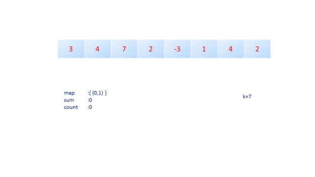
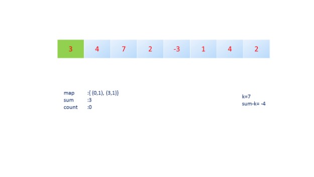
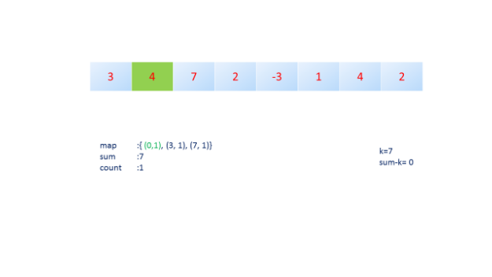
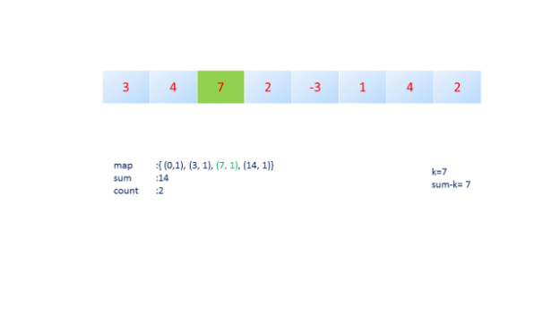
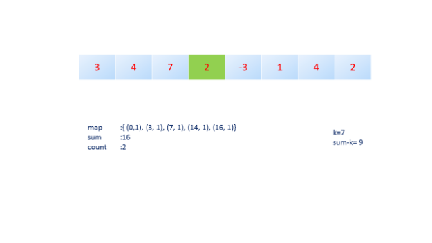
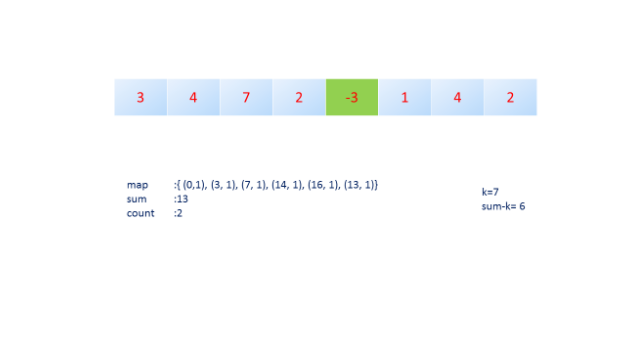
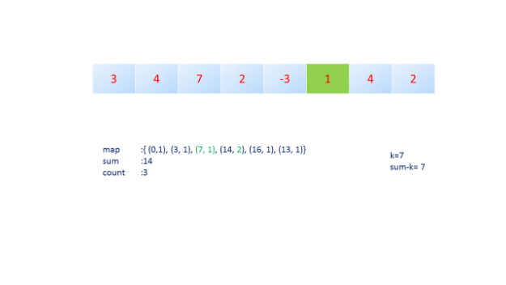
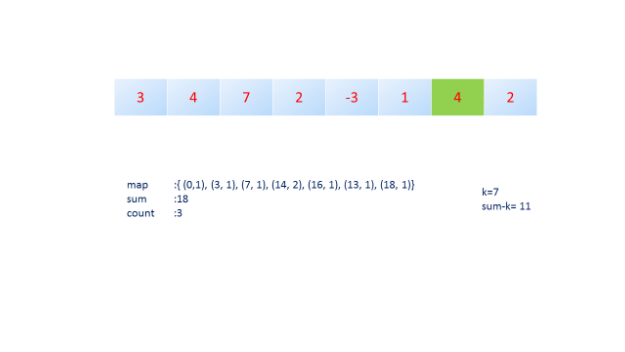
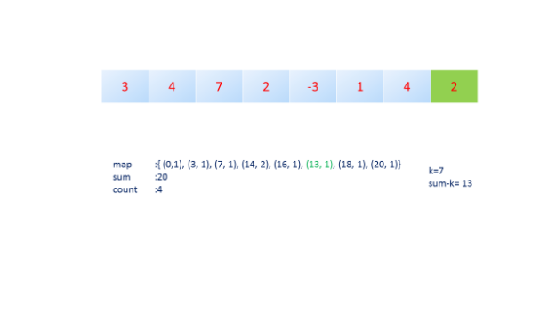

# Solution for problem 560_Subarray_Sum_Equals_K

First create a good example

```c
input: [3,4,7,2,-3,1,4,2]
k = 7
```

The brute force way is use two for loops and for each outer loop fix the start point and traverse from start to end of array, when doing the traverse, check if the current sum is equal to k. The variable `sum` is the sum of elements from index i to index j.

```c++
class Solution {
public:
    int subarraySum(vector<int>& nums, int k) {
        int len = nums.size();
        if (len == 1) return nums[0]==k;
        
        int sum = 0;
        int count = 0;
        for (int i = 0; i < len; i++) {
            sum = 0;
            for (int j = i; j < len; j++) {
                sum += nums[j];
                if (sum == k)
                    count++;
            }
        }
        return count;
    }
};
```

Apparently this method has O(N^2) time complexity.

Can we do it faster? Do we have to sacrifice the memory complexity?

Because we have to traverse the array at least once, so the time complexity is at least O(N). and we need to calculate the sum, so the memory complexity can not be O(1), It is at least O(N).

So if we use hash map, we can record the sum from start(index 0) to the current index. Ie, use a hash map to store the sum of the array that end at each point. and because we are just interested in the sum value itself. so the key is sum and the value is the frequency of that value. for example, for the array [1,2,-2,3]. start from index 0, sum is 1, 3, 1, 4. so the hash map would be {{1,2}, {3,1}, {4,1}}.

Next question is how can we know the sum that is not start from index 0. Say start from index i and end in index j. This question is not hard, we just use sum to j minus sum to i.

Take the previous example [1,2,-2,3], when we at element 3. sum is 4, we want to look at some subarray that sum to 1.

And we look at hash map, 3 is already in it({3,1}), so we can build a subarray that sums to 4 - 3=1. Because we know there exist some index i(i smaller than current index), such that the sum from 0 to i is equal to 3, since {3,1} is already in the map. So we can get the sum of i to j by doing subtrcation. 

So, during building the hash map, we also check whether the `sum - k` is in the map, and this can check if there exists some subarray( end at current element but not start from index 0) that sum to k.

Here are the process of the this algorithm for the given example. I copy the image from LeetCode solution page [click this](<https://leetcode.com/problems/subarray-sum-equals-k/solution/>)




First init sum and count to 0. Map actually don't have to contain {0,1}, it can be empty.



first element put 3 into map, and sum is 3.



Next, element is 4, sum update to 7, put 7 into map, and 7 is equal to k, so count is 1.



Next, element is 7, sum update to 14, put 14 into map, check sum -k is 7, 7 has already in the map, so the previous sum contains 7, and there is a subarray start from some point and end in current element such that the sum is equal to k. so count is 2.



Next, element is 2, just update map and sum



Next, element is -3, just update map and sum



Next, element is 1. sum update to 14, update map. Check sum - k is 7, 7 is in the map, so there is a subarray start from some point and end in current element such that the sum is equal to k. so count is 3. (7,2,-3,1)



Next, element is 4, sum update to 18, update map, check sum - k is 11. 11 is not in map. 



Next, element is 2, sum update to 20, update map, check sum - k is 13. 13 is in the map. 

Count is 4. (1,4,2)

