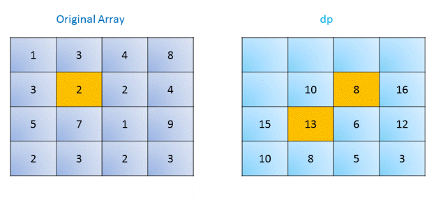

# Solution for problem 64_Minimum_Path_Sum

We start by initializing the bottom rightmost element of dp as the last element of the given matrix. Then for each element starting from the bottom right, we traverse backwards and fill in the matrix with the required minimum sums. So from rightmost bottom to leftmost top, from right to left.

We can store the minimum sums in the original matrix itself, since we need not retain the original matrix here. Thus, the governing equation now becomes:

$$\mathrm{grid}(i, j)=\mathrm{grid}(i,j)+\min \big(\mathrm{grid}(i+1,j), \mathrm{grid}(i,j+1)\big)$$

In the code, I replace the original matrix in place, but in order to illustrate it more clearly, I separate them. Take this picture as an example, if we are at 2, and we already know right step is 8 and down step is 13, so min(8+2, 13+2)= 10. Notice at the bottom row and the rightmost column we just need to update the current according to the previous one.