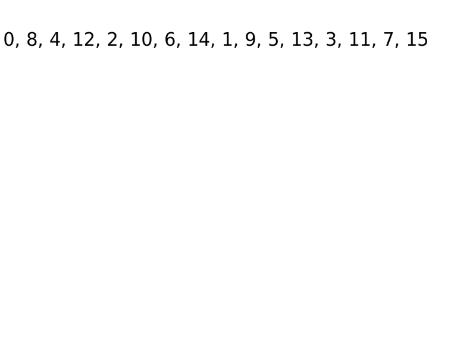

# Solution for problem 300_Longest_Increasing_Subsequence

I reference to this [article](<https://leetcode.com/problems/longest-increasing-subsequence/discuss/74824/JavaPython-Binary-search-O(nlogn)-time-with-explanation>)

Just explain more about the tail processing example, based on <https://segmentfault.com/a/1190000003819886>


```
[1,3,5,2,8,4,6]
```


For this list, we can have LIS with different length.
For length = 1, [1], [3], [5], [2], [8], [4], [6], we pick the one with smallest tail element as the representation of length=1, which is [1]
For length = 2, [1,2] [1,3] [3,5] [2,8], ...., we pick [1,2] as the representation of length=2.
Similarly, we can derive the sequence for length=3 and length=4
The result sequence would be:
len=1: [1]
len=2: [1,2]
len=3: [1,3,4]
len=4: [1,3,5,6]


According to the logic in the post,we can conclude that:
(1) If there comes another element, 9
We iterate all the sequences, found 9 is even greater than the tail of len=4 sequence, we then copy len=4 sequence to be a new sequece, and append 9 to the new sequence, which is len=5: [1,3,5,6,9]
The result is:
len=1: [1]
len=2: [1,2]
len=3: [1,3,4]
len=4: [1,3,5,6]
len=5: [1,3,5,6,9]


(2) If there comes another 3,
We found len=3 [1,3,4], whose tailer is just greater than 3, we update the len=3 sequence tobe [1,3,3]. The result is:
len=1: [1]
len=2: [1,2]
len=3: [1,3,3]
len=4: [1,3,5,6]


(3) If there comes another 0,
0 is smaller than the tail in len=1 sequence, so we update the len=1 sequence. The result is:
len=1: [0]
len=2: [1,2]
len=3: [1,3,3]
len=4: [1,3,5,6]


And here is another gif picture from Wikipedia



OK, since we know the background about this problem. We can solve this problem. We just need tiny convert.

We notice that the size of the sequence arrays is just its longest size of array. For example, 

len=1: [0]
len=2: [1,2]
len=3: [1,3,3]
len=4: [1,3,5,6]

There are 4 sequences of arrays. And the longest size of each array is 4(the size of last one). So we just need to know how many these sequences of arrays we have at end, then we can return the result.

The next thing is we notice that each time we just curious about the last element of each sequence. for example in previous sequences, we just curious about 0, 2, 3, 6. when new element comes, we find the 0, 2, 3, 6 that is just bigger than the element, if the element is bigger than 6, we add new sequence. So in this process, we can use binary search to quickly find the position. For example, if new element is 4, we know 0, 2, 3 is smaller than 4, and 6 is just bigger than 4, so replace 6 with 4, now we have 0, 2, 3, 4. OK done!

The running time of finding the position is O(logN) and we need to traverse the original array, so running time complexity is O(NlogN).